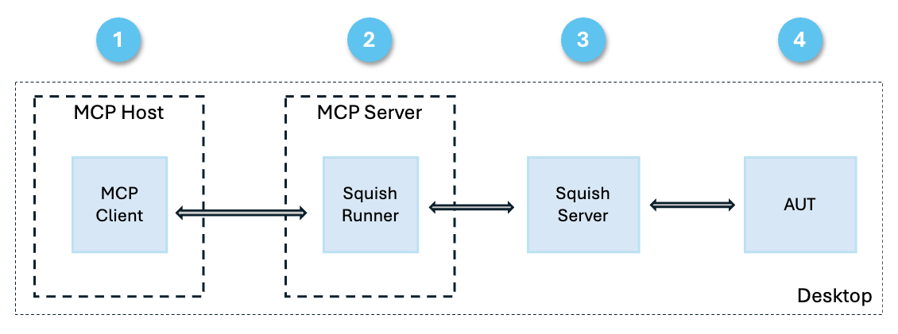

# Squish MCP 

Squish Model Context Protocol (MCP) server enables AI assistants to execute [Squish](https://www.qt.io/quality-assurance/squish) ([documentation](https://doc.qt.io/squish/)) test scripts and test suites and analyze the results. Squish is a professional testing tool for automated GUI testing of desktop, embedded, and mobile applications.

[Demo video of Squish MCP running the Addressbook example in Claude Desktop](https://youtu.be/w542DA_WHT8)

## Features

The Squish MCP server integrates Squish testing capabilities with AI workflows:

* Execute individual Squish tests or complete test suites
* Obtain test results and use the results in AI-assisted debugging and test maintenance
* Test script development through direct AI access to test outcomes

## Example commands

* "Run tst_general"  
    * For running individual test scripts  
* “Execute /projects/addressbook/suite_py” 
    * For running a full test suite and all test scripts in it 
* “Analyze and explain the error, see from git logs if there was a change explaining. Suggest changes to the test script and rerun the test script with the proposed changes” 
    * After receiving error from running a test script 

* “Create a new test case based on tst_adding and add there 10 names with hangul characters and run it in the end” 
    * Assist in sample data generation 

## Prerequisites 

* Python 3.13 or newer
* [uv](https://docs.astral.sh/uv/) - Python package installer and environment manager
* [MCP Python SDK](https://github.com/modelcontextprotocol/python-sdk) - Model Context Protocol implementation
* [Squish](https://doc.qt.io/squish/index.html) - GUI test automation tool
* A compatible MCP client:
  - Claude Desktop
  - Cursor
  - Or use the `mcp dev` command

## Installation

1. Clone or download this repository
2. Configure the `squishrunner` path in `squishrunnermcp.py` or set environment variable `SQUISH_RUNNER="/path/to/squishrunner"` 
3. Start the Squish server:
   - Run `squishserver` (default port: 4322)
   - Or use the `local` option when prompting the AI assistant
4. Configure the MCP server in your MCP client (see [Claude Desktop](https://modelcontextprotocol.io/quickstart/user) or [Cursor](https://docs.cursor.com/context/model-context-protocol#configuring-mcp-servers) documentation):

```json
{
    "mcpServers": {
        "SquishMCP": {
            "command": "<PATH TO PYTHON ENV/BIN>/.venv/bin/python",
            "args": [
                "<PATH TO THE REPOSITORY CLONE>/squish-mcp/squishrunnermcp.py"
            ]
        }
    }
}
```

## Architecture



* The AI assistant (e.g. Claude Desktop) runs both the MCP client and the MCP Server
* Command line tool `squishrunner` is wrapped by `squishrunnermcp.py`
* Application under test (AUT) is invoked by `squishserver` 

## Troubleshooting

Common issues and solutions:

1. **squishrunner not found**
   - Verify the path configuration in `squishrunnermcp.py`
   - Ensure Squish is correctly installed and available in PATH

2. **Connection refused errors**
   - Check if `squishserver` is running
   - Verify the port number (default: 4322)

## License

This project is licensed under the Apache 2 License - see the [LICENSE](LICENSE) file for details.

## Contact

For questions and support:
- Open an issue in the repository
- Contact the author
