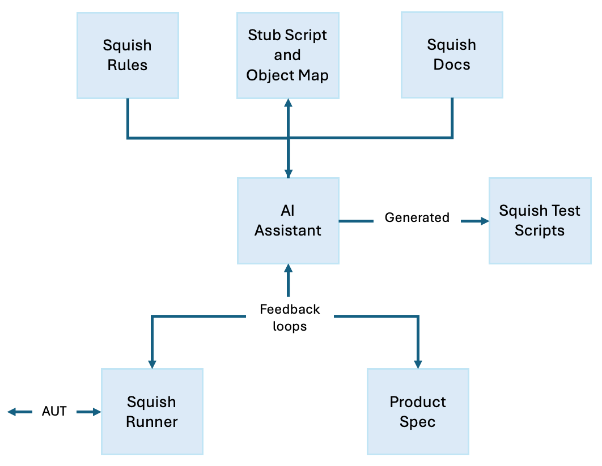

# Squish MCP Server

Squish Model Context Protocol (MCP) server enables AI assistants to write & execute [Squish](https://www.qt.io/quality-assurance/squish) ([documentation](https://doc.qt.io/squish/)) test scripts and test suites and analyze the results. Squish is a professional testing tool for automated GUI testing of desktop, embedded, and mobile applications.

[Demo video of Squish MCP running the Addressbook example in Claude Desktop](https://youtu.be/w542DA_WHT8)

## Overview

The Squish MCP Server is a  automation tool that bridges the gap between AI-driven development and Squish test automation. It provides comprehensive context analysis, context-aware code generation, and streamlined test execution for Qt Squish test projects.

The contents in this MCP are written from a general perspective. It is encouraged to adapt, modify, and extend the functionality currently implemented to best suit your desired way of working with Squish tests. Providing accurate context for the details of your project give AI models "the best chance" at producing results in a way that you would expect someone on your team to produce results.

### Key Features

- [**Comprehensive Context Analysis**](#1-initialize-squish-context)
- [**Page Object Reference Generation**](#4-generate-page-object-style-object-map)
- [**Contextually-aware Test Script Generation & Modification**](#5-generate-a-new-test-case-via-prompt)
- [**Test Execution**](#2-execute-a-test-casetest-suite)
- [**BDD Test Case Support**](#6-generate-a-bdd-test-case)

Before using any features provided by this MCP, please review the further [usage descriptions](#usage) for each aforementioned linked section to better outline the capabilities, and limitations, of each type of feature.

## Requirements

### System Requirements

- **Python 3.10+** (Required for f-string usage and type hints, and the fastmcp package)
- [**Squish Test Automation Tool**](#squish-installation)

### Squish Installation

Ensure Squish is properly installed and accessible via command line:
- `squishrunner` and `squishserver` command available in PATH
- Valid Squish license
- Pre-configured test projects or object maps are optional, but can be observed to provide the MCP with relevant context
For a Squish license, [contact the Qt Group](https://www.qt.io/quality-assurance/download)
- Most script development and execution usage provided by this MCP assumes that an AUT has already been mapped in the Test Suite settings for the current/request Squish test suite.

## Installation
For python package installation, use your Python package manager of choice (pip, uv, etc.)

1. Clone the repository:
```bash
git clone <repository-url>
cd squish-mcp
```

2. Install Python dependencies:
```bash
pip install fastmcp pyyaml psutil
```

3. Modify the contents of `cli/__init__.py`
Contained within this file are several environment variables the inform the MCP of the Squish Installation on the local system. Ensure the following variables are updated:
- SQUISH_DIR
- DEFAULT_HOST
- DEFAULT_PORT
- GLOBAL_SCRIPT_DIRS

4. Configure additional contextual rules (optional):
```bash
vim SQUISH-RULES.yaml
```

5. Configure the MCP for use in your desired LLM. For example, for [Claude Code MCP configuration see here](https://docs.claude.com/en/docs/claude-code/mcp).
```json
{
    "mcpServers": {
        "SquishMCP": {
            "command": "<PATH TO PYTHON ENV/BIN>/.venv/bin/python",
            "args": [
                "<PATH TO THE REPOSITORY CLONE>/squish-mcp/squishrunnermcp.py"
            ]
        }
    }
}
```

## Usage

If using a command line AI agent (such as claude code), it is recommended to launch the agent from within the directory of a Squish test suite that you want to operate within.

The server runs on stdio transport and is typically used with MCP-compatible clients like Claude Code.

Once your MCP server is up and running, you are ready to start prompting! It is recommended to set the current working directory of the AI agent to be the test suite directory you wish to operate within. It is not required however, as you can still point your agent to any given directory to work within.

Note: Many LLMs/ agents operating on your local system by default will request permission to run any functions that either read or write to a give file. This "interactive prompt response" behavior can be configured to operate at a lesser extent, or disabled entirely at your own risk. See your corresponding LLM/AI model documentation for further details.

### 1. Initialize Squish Context

**Prompt Example:**

It is recommended that when using the agent/MCP to ensure that you initialize all the relevant Squish context. This ensure's the agent is provided with information about the existing automation code base, object references, and rules you have already defined so that it can produce results 'more like' a team member would. In the existing implementation this is something you have to request the agent to do using one of the below prompts. However, if you want this initialization to occur automatically by the agent, you can uncomment the function `initialize_squish_environment_and_contexts()` in `squish_mcp.py` right before `mcp.run()` is called.

```
"I'm going to use Squish. Initialize the environment."

"Prepare my Squish MCP environment"
```

This will analyze your project structure, global scripts, object references, and existing test patterns to provide intelligent assistance.

*For direct invocation: see `initialize_squish_context_mcp()`*

### 2. Execute a Test Case/Test Suite

You can request the MCP to run either a full test suite, or individual test case.

**Prompt Examples:**
```
"Run the Squish test suite in this directory"

"Execute the tst_login test case"

"Run all Squish tests from suite_regression"
```

The MCP will automatically determine paths, configure context variables, and execute the appropriate Squish commands. All test executions run from the LLM will produce an HTML report in the current working directory in a folder titled 'squish_mcp_results'.

*For direct invocation: see `run_test_mcp(test_suite_path, context, test_path, suite_or_test_case)`.*

### 3. Get Object Reference Information

**Prompt Examples:**
```
"Show me how object references are organized in this project"

"Analyze the object map structure and tell me the best patterns to follow"
```

This provides comprehensive analysis of how objects are stored (names.py files, global scripts, etc.) and usage patterns.

*For direct invocation: see `get_squish_contexts()` for comprehensive analysis or `analyze_object_map_structure_mcp()` for object-specific details.*

### 4. Generate Page Object Style Object Map
DISCLAIMER: This feature is currently only supported for Qt/QML applications. Application's produced with different GUI toolkits have different property:value combinations used in the object references stored in Squish's object map files. As such, the parsing implemented in this feature is focused solely on understanding how to narrow down all the elements in an application object tree to add only the "functional layers".

You can request the MCP to generate custom object map files in accordance with any custom syntax or structure currently used in your object references. If you store object references in more than one file, or have custom locater functions regularly used to capture dynamic elements, the MCP can take those into consideration. The one required element to feed into the MCP is an 'object snapshot' as produced from the saveObjectSnapshot() Squish function. 

The general idea is to produce one 'object snapshot' xml file per "page" in the application that you want to create object references for. So before requesting the MCP to perform this function, create a test script similar to that of the `scripting/SAMPLE-OBJECT-GENERATION-test.py`. For each page, you don't need to select the top-most application object, but select the lowest level object corresponding to the page and all its contents inside. 

Once the object snapshot XML files exist, you can request your LLM similar to the below prompts to generate one object map per .xml file.

Modifications to the implementation of this feature may likely be required. It is highly likely that some objects of interest were not captured.

The general 'object filtering process' used by the MCP is as follows:
1. An object snapshot of a page in the application (or the whole application) is programmatically reviewed and all objects of type specified in the variable `skip_types` in `scripting/parse_object_snapshot.py` are excluded. Additionally, duplicate objects (i.e. objects without enough uniquely identifying information) are eliminated. The aforementioned script produces a python file, very similar to the conventional `names.py` used by Squish.
2. This filtered object map is then consumed by the MCP. The MCP takes into consideration how object references are currently captured in your active test suite. Whether that is largely using the existing names.py file, or separating into page-specific object maps, or using classes/functions to wrap object symbolic names in other features. It will attempt to adapt the simple names.py-like implementation into whatever design pattern(s) are actively in place in the active test suite if they exist. You can follow the logic starting at `generate_page_objects_from_snapshot_mcp()` to see how this occurs.

**Prompt Examples:**
```
"Create page object style references for all XML files in /path/to/dir. Ensure the object maps are in alignment with current object reference naming patterns and scripting conventions"

"Generate page objects from this XML snapshot file: /path/to/snapshot.xml for the LoginPage"
```

The MCP will analyze your existing patterns and generate consistent object references.

*For direct invocation: see `generate_page_objects_from_snapshot_mcp(xml_file_path, page_name)`.*

### 5. Generate a New Test Case via Prompt
Prompts for Test Case generation require a particular balance to get "just right". If your prompt doesn't contain enough detail, the AI model has to make a lot of guesses and assumptions which could yield more innaccuracies. If you have to provide too much information and find you're writing a novel to describe your test case, well maybe it would have been more efficient to script it yourself! It may take some trial and error to find the "goldilocks" level of prompting. Certainly play around with different levels of prompts for the same request and compare & contrast the outputs to find what you're happy with.

Additionally, you could ask your AI agent to read in from some existing manual test cases (from a CSV, XLSX, DOCX, etc.). From there it should know to use this MCP function to generate the resulting script with.

**Prompt Examples:**
```
"I'd like to make a new test in the suite_regression test suite. Launch the application, navigate to the 'Vehicle page'. One by one select the four indicators at the top of the page, and toggle them on then off. After toggling each one, take a screenshot verification point of the 3D car model on this page. Allow a brief delay after the toggle to let an animation play out"

"Make a new test case. After launching the application, navigate to the Media Tab. Go through all the 'tracks' in the music playlist dialog and select them. Verify each selected track on this page, is also present on the Vehicle page in the media player component there. Repeat for all tracks."
```

The MCP will analyze existing test patterns and generate consistent, properly structured test cases.

*For direct invocation: see `create_test_case_mcp(suite_path, test_case_name, test_content, update_suite_conf)` or use `generate_test_template_mcp(test_case_name, suite_path, test_description)` for template generation.*

### 6. Generate a BDD Test Case
Squish has it's own implementation and structure for running BDD tests. The MCP is aware of this structure and can produce both feature files and step function implementations.

**Prompt Examples:**
```
"Convet my exists tst_happy_path_1 into a BDD test"

"Using a BDD test case, <insert all requestd steps here, similar to 5. Generate a New Test Case via Prompt above>"
```

The MCP will create both test.py and test.feature files with proper BDD structure, including step definitions and feature file format.

*For direct invocation: see `create_test_case_mcp(suite_path, test_case_name, is_bdd=True, test_description)` or `generate_bdd_template_mcp(test_case_name, test_description)`.*

### Additional Available Tools

The MCP also provides tools for configuration management, code improvement suggestions, and global script analysis. Simply ask the LLM for help with any Squish-related task, and it will leverage the appropriate MCP tools automatically.

## Configuration

### SQUISH-RULES.yaml

For adding general "rules of thumb" for the LLM to follow, customize project-specific patterns and conventions:

```yaml
memories:
  requested_patterns:
    - pattern: "user asks for a screenshot verification"
      context: "Use the verify_image() function from global scripts"
    - pattern: "BDD step function with variable input"
      context: "Use |any| notation for variable parameters"
    - pattern: "Any time you, the LLM/ the AI agent, aren't sure of what to do in a test script"
      context: "Add a 'TODO: *' comment where you explain what needs to be done in a missing area."
```

## Best Practices

### Test Development Workflow

1. **Initialize Context**: Start with either asking the LLM to "Initialize my Squish MCP environment" or call  `initialize_squish_context_mcp()` for optimal context aware responses.
2. **Analyze Existing Patterns**: Use `get_squish_contexts()` to understand project structure
3. **Generate Templates**: Create consistent tests with `generate_test_template_mcp()`
4. **Follow Object Patterns**: Use discovered object reference patterns for consistency
5. **Leverage BDD**: Use BDD structure for behavior-driven scenarios

## Architecture



* The AI assistant (e.g. Claude Desktop) runs both the MCP client and the MCP Server
* Command line tool `squishrunner` is wrapped by `squishrunnermcp.py`
* Application under test (AUT) is invoked by `squishserver` 

## Privacy & Security
IMPORTANT
Any information sent to an AI Model, through the MCP or directly, is subject to the data privacy and security policies of the owning entity. Always review these policies before sending confidential or proprietary information.

### Code Quality
Note: All LLM generated results are potentially subject to a large amount of variability. It is recommended to review ALL output generated from any AI model.

## License

See the [LICENSE](LICENSE) file for details.

## Contact
For questions and support:
- Open an issue in the repository
- Contact the author


